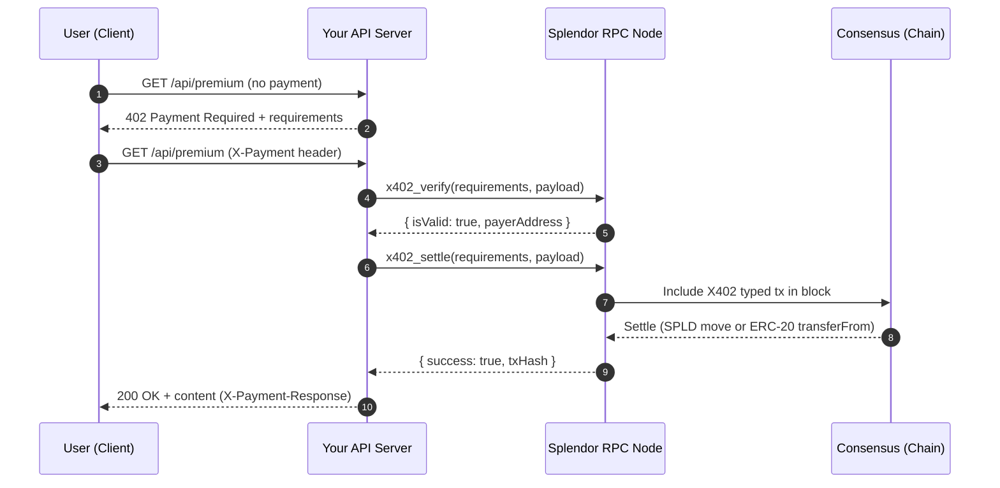
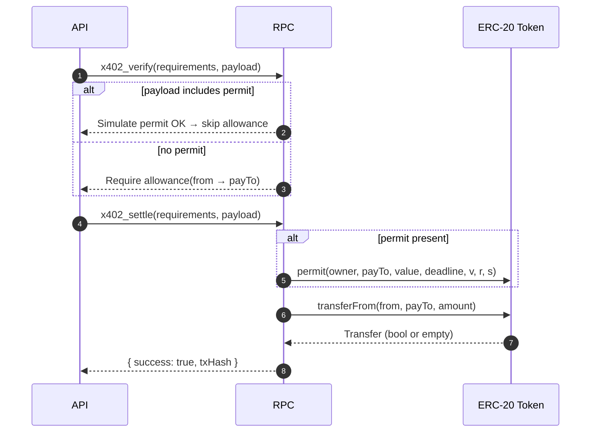

# x402 Diagrams

## End‑to‑End Flow

```mermaid
sequenceDiagram
    autonumber
    participant U as User (Client)
    participant A as Your API Server
    participant R as Splendor RPC Node
    participant C as Consensus (Chain)

    U->>A: GET /api/premium (no payment)
    A-->>U: 402 Payment Required + requirements
    U->>A: GET /api/premium (X-Payment header)
    A->>R: x402_verify(requirements, payload)
    R-->>A: { isValid: true, payerAddress }
    A->>R: x402_settle(requirements, payload)
    R->>C: Include X402 typed tx in block
    C-->>R: Settle (SPLD move or ERC‑20 transferFrom)
    R-->>A: { success: true, txHash }
    A-->>U: 200 OK + content (X-Payment-Response)
```

## ERC‑20 With Permit

```mermaid
sequenceDiagram
    autonumber
    participant A as API
    participant R as RPC
    participant T as ERC‑20 Token

    A->>R: x402_verify(requirements, payload)
    alt payload includes permit
      R-->>A: Simulate permit OK → skip allowance
    else no permit
      R-->>A: Require allowance(from → payTo)
    end
    A->>R: x402_settle(requirements, payload)
    alt permit present
      R->>T: permit(owner, payTo, value, deadline, v, r, s)
    end
    R->>T: transferFrom(from, payTo, amount)
    T-->>R: Transfer (bool or empty)
    R-->>A: { success: true, txHash }
```

